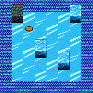
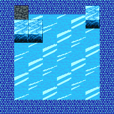

# Tarea 3

Fecha de entrega: Viernes 28 de octubre 2016

## Objetivos

* Resolver un problema de optimización
* Diseñar una función de hash ad-hoc a un problema

## Introducción

Soledad Carrión, aburrida de que alumnos sin autorización le pidieran que abriera la puerta del DCC, diseñó un sistema de puzzles en las catacumbas del edificio San Agustín que para un verdadero alumno del DCC no significarían mayor dificultad.

Se te ha quedado la TUC en tu casa, por lo que al pedirle a la Sole que te abra ella activó la trampilla y te envió directo a las catacumbas para que pienses en lo que has hecho.

Aquí abajo no hay calefacción, por lo que está casi todo cubierto de hielo. Te das cuenta que hay grandes botones desperdigados por el suelo del subterráneo. Estos se activan al pararte sobre ellos, pero al salirte vuelven a desactivarse.

Se te ocurre que podrías mover uno de esos grandes bloques de hielo para mantener activado el botón, pero estos se resbalan a lo largo del hielo en el piso.

Atrapado en esta cueva, no te queda otra opción que sacar tu laptop y ponerte a programar para resolver el problema antes de que se te acabe la batería.

## Problema

La cueva es una grilla de **w** x **h** donde cada celda es de un tipo distinto. Todo en ella es inmóvil, excepto por los bloques de hielo que hayan en ella.

Tu objetivo es mantener todos los botones presionados a la vez. Para esto debes posicionar un bloque de hielo sobre el botón, considerando que estos se resbalan a lo largo de la cueva y serán frenados segun ciertas condiciones.

Un ejemplo con un puzzle de **8** x **8**


En este caso, tenemos 3 bloques de hielo y un solo botón. A continuación se presenta el comportamiento de cada uno de los elementos del problema.

| Elemento | Nombre | Comportamiento |
| - | - | - |
|  | Piso de hielo | Bloques de hielo en movimiento se deslizan sobre este tipo de celda, continuando su movimiento en esa dirección  |
|  | Botón | Igual comportamiento que el piso de hielo. Tu objetivo es dejar un bloque de hielo encima de cada botón |
|  | Piso Antihielo | La tecnología superior de este piso frena a los bloques de hielo que traten de pasar por celdas de este tipo |
|  | Muro de roca | La roca sólida de estos muros frena a los bloques de hielo que choquen con ella |
|  | Bloque de hielo | Puede ser empujado en una dirección siempre que la celda opuesta no sea un bloque de hielo ni un muro de roca |

Para resolver este problema entonces, se puede hacer uso de los siguientes movimientos:

* Empujar bloque en la fila **r** y columna **c** hacia la derecha
* Empujar bloque en la fila **r** y columna **c** hacia la izquierda
* Empujar bloque en la fila **r** y columna **c** hacia arriba
* Empujar bloque en la fila **r** y columna **c** hacia abajo


De aquí en adelante el desplazamiento de un bloque será referido como `push fila columna dirección`. Por lo tanto, lo anterior queda:

* `push r c R`
* `push r c L`
* `push r c U`
* `push r c D`

( Por sus nombres en inglés, R = right, L = left, U = up, D = down )

Con `0 <= r < h, 0 <= c < w`

A continuación se presentan los distintos pasos que resuelven el problema anterior:

| push 3 6 U | push 4 3 L | push 4 1 U |
| :-: | :-: | :-: |
|  |  |  |

Notar que en la tercera iteración, la operación `push 2 1 D` ya no es válida, ya que el bloque en la posición `1 1` te impide pararte detrás del bloque `2 1` para empujarlo.

| **push 5 5 R** | **push 5 6 U** | **push 2 6 L** |
| :-: | :-: | :-: |
|  |  |  |

Deberás escribir un programa en C que dado la descripción de un problema, entregue la secuencia óptima de pasos que lo resuelven. Esto es, una secuencia tal que no existan secuencias con menos pasos que resuelvan el problema. Ten en cuenta que la cantidad de celdas que se desplaza un bloque por cada movimiento no afecta esto: sólo importa la cantidad de instrucciones `push`.

Se espera que resuelvas el problema usando una variante de **DFS** llamada **IDDFS**, utilizando una **Tabla de Hash** para aprovechar los datos de las iteraciones anteriores.

## Análisis

Deberás entregar un informe donde analices tu solución al problema. Se espera lo siguiente:

* ( 1 pt ) Qué algoritmo escogiste para resolver el problema y por qué este es una buena opción. Habla de sus ventajas y desventajas frente a otras opciones.
* ( 4 pt ) Sobre tu función de hash. En particular:
 * ( 1pt ) Sobre qué datos trabaja
 * ( 1pt ) Cuál es el costo de calcularla
 * ( 1pt ) Cuál es el intervalo más pequeño que contiene su recorrido
 * ( 1pt ) Cómo distribuye tu función a largo de la tabla
* ( 1 pt ) Como manejas las colisiones en tu tabla de hash y porqué


## Input

Tu programa deberá recibir los siguientes parámetros:

1. Ruta al archivo que contiene la descripción del problema
2. Ruta al archivo donde deberás guardar la secuencia de pasos que resuelve el problema

de la siguiente manera:

```sh
./solver puzzle.txt output.txt
```

El archivo de input tiene **h + 2** líneas. La primera línea contiene el valor de **w**, la segunda el valor de **h**, y las siguientes **h** contienen cada una **w** caractéres separados por un espacio, representando las distintas celdas del tablero como sigue:

| Elemento | Representación |
| :-: | :-: |
|  | `'_'` |
|  | `'o'` |
|  | `'#'`|
|  | `'X'` |
|  | `'H'` |

El archivo del puzzle de ejemplo sería entonces:

```
8
8
# # # # # # # #
# X _ _ _ _ _ #
# _ o _ _ _ _ #
# _ _ _ _ _ H #
# _ _ H _ _ _ #
# _ _ _ _ H _ #
# _ _ _ _ _ _ #
# # # # # # # #
```

## Output

Tu archivo de output deberá contener **k + 1** líneas, donde **k** es la cantidad de pasos con que tu programa resuelve el problema.

La primera línea será el valor de **k**, y las siguientes **k** líneas serán los pasos sucesivos que resuelven el problema.

El output del ejemplo sería entonces:

```
6
push 3 6 U
push 4 3 L
push 4 1 U
push 5 5 R
push 5 6 U
push 2 6 L
```

## Evaluación

La nota de tu tarea estará descompuesta en dos partes:

* 60% a que tu código entregue un resultado correcto. Se probarán distintos casos
* 40% a tu informe

Los test tendrán un tiempo límite de 10 segundos c/u corriendo en un Lenovo G50-45 con Ubuntu 16.04. Si no has respondido en ese tiempo tu programa será cortado y tendrás 0 puntos en ese test.

## Entrega

Deberás entregar tu tarea en el repositorio que se te será asignado; asegurate de seguir la estructura inicial de éste.

Se espera que tu código compile con `make` dentro de la carpeta **Programa** y genere un ejecutable de nombre
`solver` en esa misma carpeta

Se espera que dentro de la carpeta **Informe** entregues tu informe, con el nombre _Informe.pdf_

Por cada regla que no cumplas se te aplicará un descuento porcentual a tu nota final.

Se recogerá el estado de la rama `master` de tu repositorio, 1 minuto pasadas las 24 horas del dı́a de entrega.
Recuerda dejar ahı́ la versión final de tu tarea. No se permitirá entregar tareas atrasadas.

## Bonus

A continuación, formas de aumentar la nota obtenida en tu tarea. Estos aplicarán solo si la nota involucrada es mayor
o igual a 4.

##### Manejo de memoria perfecto (+5% a la nota de Código)

Se aplicará este bonus si valgrind reporta en tu código 0 leaks y 0 errores de memoria, considerando que tu programa
haga lo que tiene que hacer.

##### Buen uso del lenguaje y la estructura (+5% a la nota de Código)

Se aplicará este bonus si tu código es ordenado, bien estructurado y utilizas el estilo de programación de C. A criterio
del corrector.

##### Ortografía y gramática perfecta (+5% a la nota de Informe)

Se aplicará este bonus solo si tu ortografı́a y gramática en el informe son impecables, considerando que tengas una
cantidad razonable de texto.

##### Buen uso del espacio y del formato (+5% a la nota de Informe)

La nota de tu informe aumentará en un 5 % si tu informe está bien presentado y usa el espacio y formato a favor de
entregar la información. A juicio del corrector.


## Anexo: Código base e interfaz gráfica

Tus ~~apuestos~~ ayudantes han preparado con mucho amor una interfaz gráfica para ayudarte a resolver el problema. Esta se llama `watcher`, y para usarla deberás decir en tu código

```c
#include "../watcher/watcher.h"
```

Esta cuenta con las siguientes funciones:

```c

/** Abre un watcher de las dimensiones especificadas */
void watcher_open(int width, int height);

/** Indica el tipo de celda del mapa en una posicion dada */
void watcher_set_cell_type(int row, int col, CellType type);

/** Indica que hay un bloque de hielo en la posicion especificada */
void watcher_cell_ice_block(int row, int col);

/** Indica que la celda especificada está vacía */
void watcher_cell_empty_cell(int row, int col);

/** Guarda una imagen .png con el estado actual del watcher
    No olvides incluir el .png en el nombre del archivo */
void watcher_snapshot(char* filename);

/** Cierra el watcher */
void watcher_close();

```

Para ayudarte a modelar el problema además se preparó un **enum** que representa los distintos tipos de celdas. Se llama `CellType`, y para usarlo deberás decir en tu código

```c
#include "../puzzle/cell_type.h"
```

Este tiene los siguientes valores:


```c

typedef enum
{ 	
	/* Piso de hielo */
	ICE,
	/* Muro de roca */
	WALL,
	/* Piso antihielo */
	ANTI_ICE,
	/* Botón */
	BUTTON
} CellType;

```
